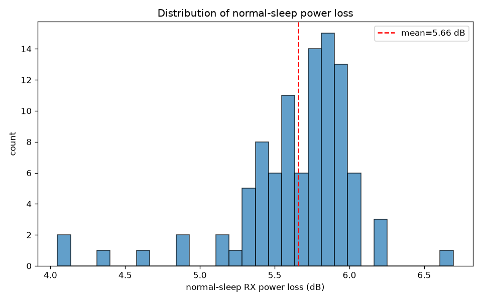
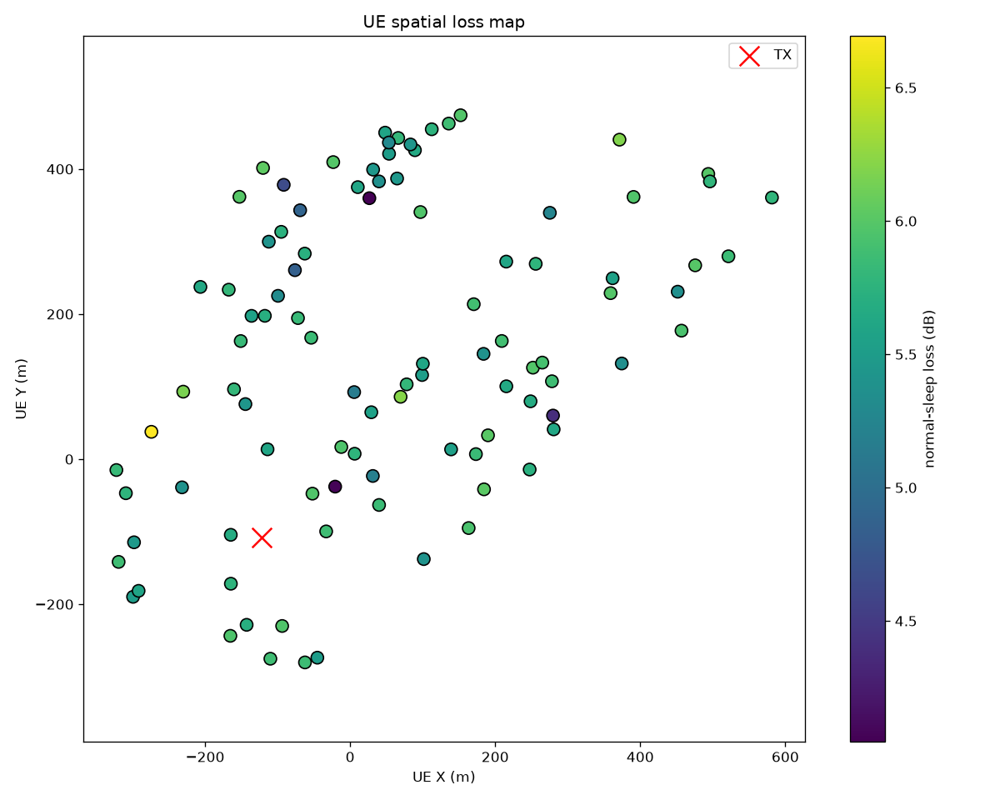
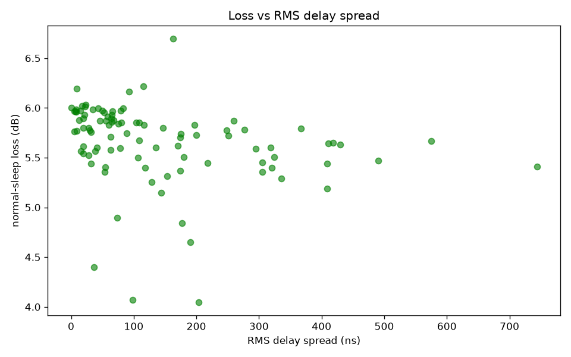

# Results: RI=1 Antenna Panel Muting in Ginza (100 UE)

This page summarizes the 100-UE dataset generated with the configuration
described in [`system_model.md`](system_model.md). The dataset was produced with
config hash `1d387ae5c6be6a0a1568909091aca43ad38bf3af6877afb1406ff14a1957304f`
and git commit `018a043bba4f0687cde594505407d501302cb84b`. The full artifact is
kept outside this repository.

## 1. Sample set

| Item | Count / Value |
|---|---|
| Requested UEs | 100 |
| Successful UEs | 97 |
| Failed UEs | 3 (UE 32, UE 39, UE 65) |
| LOS UEs | 14 |
| NLOS UEs | 83 |
| Selected PMI valid | 97 / 97 (100 %) |
| Center PMI ≠ wideband PMI | 64 / 97 |

The three failures all raised `NoValidPathsError`: the Sionna RT PathSolver
returned zero valid paths for those UE positions. They are retained as failed
checkpoints rather than silently dropped.

## 2. Loss distribution

The quantity of interest is the wideband SNR loss from normal (full 128-port
panel) to sleep (right-half panel muted):

```text
loss_db = normal_snr_db - sleep_snr_db
```

| Statistic | Value |
|---|---|
| Min | 4.05 dB |
| 5th percentile | 4.88 dB |
| Median | 5.75 dB |
| Mean | 5.66 dB |
| 95th percentile | 6.02 dB |
| Max | 6.69 dB |
| Standard deviation | **0.40 dB** |



The loss is tightly concentrated near the theoretical 6 dB value, with only a
small positive skew caused by a few NLOS UEs whose dominant multipath arrives
from the active half of the panel.

## 3. Fixed 6 dB baseline

Using the naive rule `predicted_sleep_snr_db = normal_snr_db - 6.0`:

| Metric | Value |
|---|---|
| MAE | **0.37 dB** |
| RMSE | 0.53 dB |
| p95 absolute error | 1.12 dB |
| Maximum absolute error | 1.95 dB |
| Mean signed error | -0.34 dB |
| \|error\| > 0.5 dB | 25 / 97 |
| \|error\| > 1.0 dB | 6 / 97 |
| \|error\| > 2.0 dB | 0 / 97 |


The fixed 6 dB rule is already accurate enough for many link-budget purposes.
Predicting the residual would require sub-0.5 dB accuracy, which leaves little
headroom for an ML model to outperform a constant.

## 4. Spatial and feature patterns

The spatial loss map shows that deviations from the mean are not strongly
correlated with TX–UE distance, but some edge UEs (especially in the upper-right
quadrant of the scene) show slightly lower loss.



The strongest observed relationships are:

| Feature | Pearson r | Spearman ρ | Interpretation |
|---|---|---|---|
| `center_and_wideband_pmi_differ` | -0.37 | -0.43 | When center and wideband PMI differ, sleep loss tends to be slightly lower. |
| `rms_delay_spread_s` | -0.25 | -0.48 | Larger delay spread weakly correlates with lower sleep loss. |
| `normal_snr_db` | +0.12 | +0.11 | Very weak positive correlation. |
| `tx_ue_distance_2d_m` | +0.02 | +0.03 | Essentially uncorrelated. |



These are descriptive correlations, not causal claims.

## 5. Grouped summary

| Group | n | Mean loss | Median loss | Std | Min / Max |
|---|---|---|---|---|---|
| LOS | 14 | 5.81 dB | 5.84 dB | 0.25 | 5.25 / 6.22 |
| NLOS | 83 | 5.63 dB | 5.72 dB | 0.41 | 4.05 / 6.69 |
| Center PMI == wideband PMI | 33 | 5.86 dB | 5.90 dB | 0.23 | 5.45 / 6.69 |
| Center PMI != wideband PMI | 64 | 5.55 dB | 5.63 dB | 0.42 | 4.05 / 6.22 |
| Invalid PMI selected | 0 | — | — | — | — |

Key observations:

- NLOS UEs show slightly wider spread than LOS UEs, as expected from richer
  multipath.
- UEs whose wideband PMI differs from the center-frequency PMI tend to have
  lower sleep loss, suggesting that the wideband-optimal beam places more energy
  in directions covered by the active half of the muted panel.
- No UE selected an invalid PMI in this 100-UE sample, so `selected_pmi_valid`
  does not create a usable binary split here.

## 6. Conclusion and boundaries

The RI=1 right-half muting experiment confirms the expected physical behavior:

1. The mean sleep-mode SNR loss is **~5.66 dB**, very close to the theoretical
   6 dB (3 dB linear-power reduction from muting half the ports).
2. The **fixed 6 dB rule has MAE 0.37 dB**, with only 6 of 97 UEs deviating by
   more than 1 dB.
3. A data-driven regression model trained on this dataset would have little to
   predict beyond a constant, because the residual variance is only ~0.4 dB.

### What this result does **not** mean

- It does not prove that all muting strategies are equally easy to predict.
- It does not address MU-MIMO, rank > 1, beam reselection, per-subcarrier
  behavior, or different muting patterns.
- It does not include MCS/BLER, so any operational conclusion about throughput
  or coverage requires further steps.

### Suggested next steps

1. **Per-subcarrier worst-case analysis:** instead of predicting average loss,
   characterize `sleep_snr_p5_db` and the number of subcarriers below an MCS
   threshold.
2. **Sleep beam reselection gain:** re-run the beam sweep after applying the
   muting mask and quantify how much loss can be recovered.
3. **Alternative muting patterns:** compare left-half, checkerboard, and
   interleaved muting masks.
4. **Larger or more diverse scenes:** the Ginza dataset is helpful as a
   reference but may not span the full spatial/scattering variability needed for
   a generalizable ML model.

---

*Last updated: 2026-08-25. Analysis script: `src/mMIMO_sleep/data/...` and the
EDA summary in the external dataset directory.*
